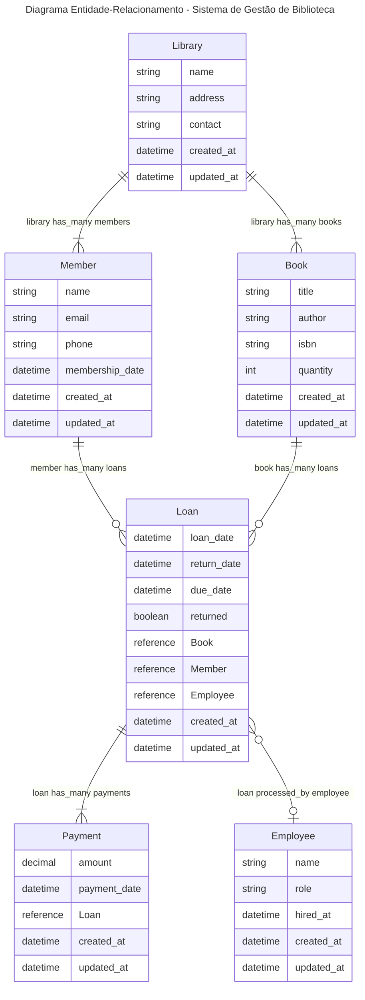

# Sistema de Gestão de Biblioteca

## Descrição

Este é um sistema de gerenciamento de empréstimos de livros, onde é possível registrar usuários, livros, autores, além de realizar o empréstimo e a devolução dos livros. O sistema oferece funcionalidades como listar livros, visualizar histórico de empréstimos, cadastrar novos usuários, entre outros.

O sistema foi desenvolvido em Java e permite a interação com o usuário por meio de um menu de opções, onde é possível realizar várias operações no sistema.

## Funcionalidades

- **Listar todos os livros:** Exibe todos os livros cadastrados no sistema.
- **Listar livros disponíveis:** Exibe apenas os livros que estão disponíveis para empréstimo.
- **Listar livros emprestados:** Exibe todos os livros que estão atualmente emprestados.
- **Emprestar livro:** Permite que um usuário empreste um livro disponível.
- **Devolver livro:** Permite que um usuário devolva um livro emprestado.
- **Cadastrar usuário:** Registra um novo usuário no sistema.
- **Listar autores:** Exibe a lista de autores cadastrados no sistema.
- **Mostrar histórico de empréstimos:** Permite que um usuário visualize seu histórico de empréstimos.

## Requisitos para Rodar

- **Java:** O código foi desenvolvido e testado com Java 8 ou superior.
- **IDE ou Compilador:** Qualquer IDE como IntelliJ IDEA, Eclipse ou NetBeans, ou até mesmo a linha de comando pode ser usada para rodar o sistema.
- **Bibliotecas:** O código não depende de bibliotecas externas para funcionar, já que utiliza apenas a biblioteca padrão do Java.

## Estrutura do Projeto

A estrutura do projeto é organizada da seguinte forma:

```
- src/
  - Author.java          // Classe que representa os autores dos livros.
  - Book.java            // Classe que representa os livros.
  - Loan.java            // Classe que representa os empréstimos de livros.
  - Main.java            // Classe com o ponto de entrada do programa e menu interativo.
  - Store.java           // Classe que contém a lógica para o gerenciamento de livros, autores, usuários e empréstimos.
  - User.java            // Classe que representa os usuários do sistema.
```

## Diagrama ER



## Como Rodar

1. **Clonar o repositório:**

   Clone o repositório para sua máquina local:

   ```
   git clone https://github.com/anaclaraaraujo/bookstore.git
   ```

2. **Compilar o código:**

   Abra o diretório do projeto na sua IDE ou via terminal e compile o código com o seguinte comando (se estiver usando o terminal):

   ```
   javac *.java
   ```

3. **Executar o programa:**

   Execute o programa com o seguinte comando:

   ```
   java Main
   ```

4. **Interagir com o menu:**

   O programa irá exibir um menu interativo onde você pode escolher diversas opções, como cadastrar livros, realizar empréstimos, etc.

## Como Contribuir

Se você gostaria de contribuir com este projeto, siga os passos abaixo:

1. Fork este repositório.
2. Crie uma branch para sua nova feature ou correção (`git checkout -b feature/nova-feature`).
3. Faça as alterações e commit (`git commit -am 'feat: adiciona nova funcionalidade X'`).
4. Se for corrigir um bug, use (`git commit -am 'fix: corrige problema com a validação de dados'`)
5. Push para a branch criada (`git push origin feature/nova-feature`).
6. Abra um pull request para que possamos revisar e mergear sua contribuição.
